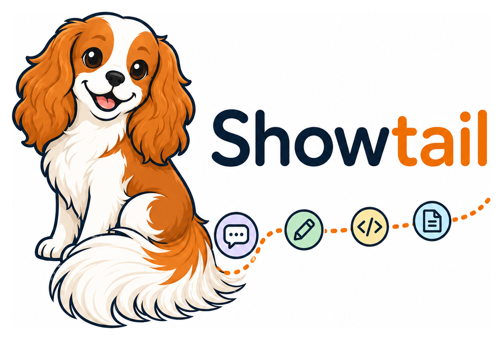

---
hide:
  - navigation
  - toc
---

<div class="st-hero" markdown>

{ width="420" }

# Show your work.

<p class="st-tagline" markdown>
Showtail keeps a clear record of how you built a project with AI — the prompts
you sent and the files you changed — captured **automatically** to a plain
`.showtail/` folder. No accounts, no cloud, no telemetry.
</p>

[Get started](getting-started/installation.md){ .md-button .md-button--primary }
[View on GitHub](https://github.com/Tingsters/Showtail){ .md-button }

</div>

---

## Why Showtail

<div class="grid cards" markdown>

-   :material-record-circle-outline:{ .lg .middle } __Automatic capture__

    ---

    Your prompts and the files your AI tool edits are recorded as you work.
    The trail builds itself — nothing to remember.

-   :material-lock-outline:{ .lg .middle } __Local &amp; private__

    ---

    Everything lives in a `.showtail/` folder in your project. No Showtail
    cloud service, no telemetry, and no automatic upload of your trail.

-   :material-tools:{ .lg .middle } __Works across your tools__

    ---

    Claude Code, OpenAI Codex, GitHub Copilot, ChatGPT, and Google Gemini all
    feed into one coherent, cross-tool timeline.

-   :material-account-group-outline:{ .lg .middle } __Team-aware__

    ---

    On a group project each student gets their own folder under one shared
    `.showtail/`, so trails merge through git without conflicts.

-   :material-file-document-outline:{ .lg .middle } __Plain, reviewable files__

    ---

    JSON and Markdown you can open in any editor and commit with the rest of
    your work. `showtail report` renders a readable summary.

-   :material-school-outline:{ .lg .middle } __Built for classrooms__

    ---

    A structured way to demonstrate genuine understanding. Not an AI detector,
    not surveillance, not a grading tool.

</div>

---

## Integrations at a glance

<p class="st-badges" markdown>
**Claude Code** ✅ &middot; **OpenAI Codex** ✅ &middot; **GitHub Copilot** 🚧 &middot; **ChatGPT / Gemini** ✅ _(import)_
</p>

[See the full capability matrix →](integrations/index.md)

---

## Install, then just work

```bash
# Install (below) — that's it, tracking is on and your AI tools are connected.
# ...just work — your prompts and edits are captured automatically...
showtail report    # when you're done: generate the report for your educator
```

There is **no setup command**. Installing turns tracking on and connects your AI tools —
including ones you install later — and Showtail sets up each project on first use. Nothing
to remember.

[Read the full quickstart →](getting-started/quickstart.md)

---

## Code signing policy

Showtail is preparing its Windows executable for SignPath Foundation code
signing. Current releases are unsigned unless their release notes explicitly say
otherwise. See the [Code signing policy](code-signing-policy.md) for status,
scope, team roles, privacy, and verification instructions.
